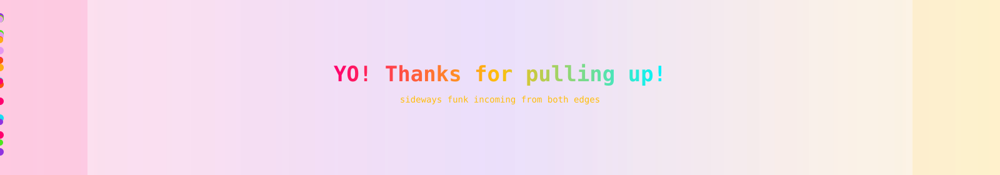

<!-- Profile README · https://github.com/BlackBeanEagles · FUNK EDITION 🪩 -->




<p align="center">
  
</p>

<p align="center">
  <picture>
    <source media="(prefers-color-scheme: dark)" srcset="https://capsule-render.vercel.app/api?type=waving&color=0:0D0221,50:FF006E,100:8338EC&height=180&section=header&text=Hridya%20Jain&fontSize=48&fontColor=ffffff&animation=twinkling&fontAlignY=38&desc=stay+funky+%C2%B7+stay+shipping&descSize=18&descAlignY=58&descAlign=50"/>
    <source media="(prefers-color-scheme: light)" srcset="https://capsule-render.vercel.app/api?type=waving&color=0:FFF0F5,50:FF006E,100:FFBE0B&height=180&section=header&text=Hridya%20Jain&fontSize=48&fontColor=0D0221&animation=twinkling&fontAlignY=38&desc=stay+funky+%C2%B7+stay+shipping&descSize=18&descAlignY=58&descAlign=50"/>
    
  </picture>
</p>

<p align="center">
  
</p>

<p align="center">
  <picture>
    <source media="(prefers-color-scheme: dark)" srcset="./assets/theme-mode-dark.svg"/>
    <source media="(prefers-color-scheme: light)" srcset="./assets/theme-mode-light.svg"/>
    
  </picture>
</p>

<h1 align="center">
  <picture>
    <source media="(prefers-color-scheme: dark)" srcset="https://readme-typing-svg.demolab.com?font=VT323&weight=700&size=32&duration=2600&pause=700&color=FF006E&center=true&vCenter=true&width=680&lines=Caffeine+%2B+chaos+%3D+working+code;AI+tools+with+main+character+energy;Security+so+tight+it+actually+slaps"/>
    <source media="(prefers-color-scheme: light)" srcset="https://readme-typing-svg.demolab.com?font=VT323&weight=700&size=32&duration=2600&pause=700&color=8338EC&center=true&vCenter=true&width=680&lines=Caffeine+%2B+chaos+%3D+working+code;AI+tools+with+main+character+energy;Security+so+tight+it+actually+slaps"/>
    
  </picture>
</h1>

<p align="center">
  
</p>

<p align="center">
  <a href="https://linkedin.com/in/hridyajain"></a>
  <a href="https://github.com/BlackBeanEagles?tab=repositories"></a>
  
</p>

<details>
<summary><b>🪩 CELEBRATION MODE</b> · click if you can handle the funk</summary>
<br/>


<p align="center">
  
  
</p>

</details>

<!-- DEV_QUOTE:START -->
> *"Ship code like it's a summer drop — loud, clean, and impossible to ignore."*
<!-- DEV_QUOTE:END -->

<p align="center"></p>

---

## `🪩 > hridya.drop_the_beat()`

<table>
<tr>
<td width="58%" valign="top">

**Full-stack dev with AI brain, security spine, and questionable sleep schedule.**

I build tools that are actually useful — commit therapists, interview coaches, secure apps — but make them feel **fun to use**, not corporate-gray.

<br/>

<!-- NOW_BUILDING:START -->
> **Now building:** [`zapsafe-mobile`](https://github.com/BlackBeanEagles/zapsafe-mobile) · `Dart` · last push `2026-06-09`

```bash
$ git clone https://github.com/BlackBeanEagles/zapsafe-mobile.git && cd zapsafe-mobile && echo "Let's build."
```
<!-- NOW_BUILDING:END -->

<br/>

<details>
<summary><b>🕺 Run <code>hridya --help</code></b> · yes, it slaps</summary>
<br/>

```bash
$ hridya --help

  COMMANDS
    status      What's cooking right now
    projects    Open the banger repos
    stack       Tools I touch daily
    now         Spotify + WakaTime (when connected)
    connect     Slide into LinkedIn DMs

  FLAGS
    --ai        LLM-powered chaos (the good kind)
    --sec       Apps locked down tighter than your ex's privacy settings
    --funk      Maximum vibe output (default: true)

$ hridya status
  ● ONLINE
  ● Main character arc: building AI + security tools
  ● Collabs welcome — bring weird ideas
```

</details>

</td>
<td width="42%" valign="top">

### Vibe feed

<!-- LIVE_FEED:START -->
| Signal | Value |
| :--- | :--- |
| **Last public activity** | `push -> BlackBeanEagles` |
| **Public repos** | `26` |
| **Followers** | `7` |
| **Profile sync** | auto-updated every 6 hours |
<!-- LIVE_FEED:END -->

<br/>


</td>
</tr>
</table>

<p align="center"></p>

---

## `🎧 > hridya.on_the_decks`

<p align="center"><i>Spotify + WakaTime refresh every 15 min · vibes are automated</i></p>

<table>
<tr>
<td width="50%" valign="top">

### Spotify

<!-- SPOTIFY_NOW_PLAYING:START -->
<table>
<tr>
<td width="72">

</td>
<td>

**Now playing** · awaiting connection

Add repo secrets `SPOTIFY_CLIENT_ID`, `SPOTIFY_CLIENT_SECRET`, and `SPOTIFY_REFRESH_TOKEN` to go live.

</td>
</tr>
</table>
<!-- SPOTIFY_NOW_PLAYING:END -->

</td>
<td width="50%" valign="top">

### WakaTime

<!-- WAKATIME_STATS:START -->
<picture>
  <source media="(prefers-color-scheme: dark)" srcset="https://github-readme-stats.vercel.app/api/wakatime?username=current&theme=radical&hide_border=true&bg_color=0D0221&title_color=FF006E&text_color=FFFFFF&layout=compact"/>
  <source media="(prefers-color-scheme: light)" srcset="https://github-readme-stats.vercel.app/api/wakatime?username=current&theme=radical&hide_border=true&bg_color=FFF0F5&title_color=8338EC&text_color=0D0221&layout=compact"/>
  
</picture>

*Add `WAKATIME_API_KEY` secret for live weekly coding breakdown.*
<!-- WAKATIME_STATS:END -->

</td>
</tr>
</table>

<details>
<summary><b>Setup Spotify & WakaTime secrets</b> · one-time</summary>
<br/>

**Spotify**
1. Create an app at [Spotify Developer Dashboard](https://developer.spotify.com/dashboard/applications)
2. Add redirect URI: `http://127.0.0.1:8080/callback`
3. Run locally: `python scripts/get_spotify_refresh_token.py`
4. Add GitHub secrets: `SPOTIFY_CLIENT_ID`, `SPOTIFY_CLIENT_SECRET`, `SPOTIFY_REFRESH_TOKEN`

**WakaTime**
1. Copy your API key from [WakaTime API settings](https://wakatime.com/settings/api-key)
2. Add GitHub secrets: `WAKATIME_API_KEY` and optional `WAKATIME_USERNAME`

</details>

---

## `🚀 > hridya.bangers --featured`

<p align="center"><i>Tap a card — these repos go hard ↓</i></p>

<table>
<tr>
<td width="50%">
<a href="https://github.com/BlackBeanEagles/Commit-Message-Therapist">

</a>
<br/><b>Commit-Message-Therapist</b> · TypeScript · your commits need therapy (same)
</td>
<td width="50%">
<a href="https://github.com/BlackBeanEagles/ReflectAI-Inside-Your-Interview-Brain">

</a>
<br/><b>ReflectAI</b> · Python · AI interview prep that actually cooks
</td>
</tr>
<tr>
<td width="50%">
<a href="https://github.com/BlackBeanEagles/NeutronNoodle">

</a>
<br/><b>NeutronNoodle</b> · TypeScript · Full-stack architecture & APIs
</td>
<td width="50%">
<a href="https://github.com/BlackBeanEagles/TechNest-Secured">

</a>
<br/><b>TechNest-Secured</b> · JavaScript · Security-first web application
</td>
</tr>
<tr>
<td width="50%">
<a href="https://github.com/BlackBeanEagles/Justredact">

</a>
<br/><b>Justredact</b> · JavaScript · Smart document redaction
</td>
<td width="50%">
<a href="https://github.com/BlackBeanEagles/Threshold-Valve-Service">

</a>
<br/><b>Threshold-Valve-Service</b> · Python · Threshold-based backend service
</td>
</tr>
</table>

<details>
<summary><b>📂 Deep dive — expand any project</b></summary>
<br/>

<details>
<summary><b>Commit-Message-Therapist</b> — stop writing "fixed stuff" commits</summary>

AI-powered workflow that reads your changes and suggests conventional, meaningful commit messages.

→ [Open repo](https://github.com/BlackBeanEagles/Commit-Message-Therapist)

</details>

<details>
<summary><b>ReflectAI</b> — practice interviews with an AI brain</summary>

Interview prep tool that helps you reflect on answers, improve structure, and build confidence.

→ [Open repo](https://github.com/BlackBeanEagles/ReflectAI-Inside-Your-Interview-Brain)

</details>

<details>
<summary><b>TechNest-Secured</b> — security baked in, not bolted on</summary>

Web app focused on auth hardening, validation, and secure-by-default patterns.

→ [Open repo](https://github.com/BlackBeanEagles/TechNest-Secured)

</details>

<details>
<summary><b>Justredact</b> — redact before you share</summary>

Hide sensitive fields in documents before sending them anywhere.

→ [Open repo](https://github.com/BlackBeanEagles/Justredact)

</details>

</details>

---

## `📈 > hridya.flex --stats`

<table>
<tr>
<td width="55%" valign="top">

<picture>
  <source media="(prefers-color-scheme: dark)" srcset="https://github-readme-activity-graph.vercel.app/graph?username=BlackBeanEagles&bg_color=0D0221&color=FF006E&line=FFBE0B&point=00F5FF&area=true&hide_border=true&custom_title=Funk%20Pulse"/>
  <source media="(prefers-color-scheme: light)" srcset="https://github-readme-activity-graph.vercel.app/graph?username=BlackBeanEagles&bg_color=FFF0F5&color=8338EC&line=FF006E&point=FFBE0B&area=true&hide_border=true&custom_title=Funk%20Pulse"/>
  
</picture>

</td>
<td width="45%" valign="top">

<picture>
  <source media="(prefers-color-scheme: dark)" srcset="https://github-readme-streak-stats.demolab.com/?user=BlackBeanEagles&theme=radical&hide_border=true&background=0D0221&ring=FF006E&fire=FFBE0B&currStreakLabel=00F5FF"/>
  <source media="(prefers-color-scheme: light)" srcset="https://github-readme-streak-stats.demolab.com/?user=BlackBeanEagles&theme=radical&hide_border=true&background=FFF0F5&ring=8338EC&fire=FF006E&currStreakLabel=FFBE0B"/>
  
</picture>

<br/>

<picture>
  <source media="(prefers-color-scheme: dark)" srcset="https://github-readme-stats.vercel.app/api/top-langs/?username=BlackBeanEagles&layout=donut-vertical&theme=radical&hide_border=true&bg_color=0D0221&title_color=FF006E&text_color=FFFFFF&langs_count=6"/>
  <source media="(prefers-color-scheme: light)" srcset="https://github-readme-stats.vercel.app/api/top-langs/?username=BlackBeanEagles&layout=donut-vertical&theme=radical&hide_border=true&bg_color=FFF0F5&title_color=8338EC&text_color=0D0221&langs_count=6"/>
  
</picture>

</td>
</tr>
</table>


<p align="center"></p>

---

## `📦 > hridya.repos --fresh`

<!-- RECENT_REPOS:START -->
- [zapsafe-mobile](https://github.com/BlackBeanEagles/zapsafe-mobile) — Dart · 2026-06-09
- [Generative](https://github.com/BlackBeanEagles/Generative) — JavaScript · 2026-06-04
- [NeutronNoodle](https://github.com/BlackBeanEagles/NeutronNoodle) — TypeScript · 2026-05-29
- [Commit-Message-Therapist](https://github.com/BlackBeanEagles/Commit-Message-Therapist) — TypeScript · 2026-05-29
- [TechNest-Secured](https://github.com/BlackBeanEagles/TechNest-Secured) — JavaScript · 2026-05-14
- [am.sc.u4cse23040](https://github.com/BlackBeanEagles/am.sc.u4cse23040) — Python · 2026-05-06
<!-- RECENT_REPOS:END -->

---

## `🐍 > hridya.snake --disco`

<p align="center">
  <picture>
    <source media="(prefers-color-scheme: dark)" srcset="./assets/github-snake-dark.svg"/>
    <source media="(prefers-color-scheme: light)" srcset="./assets/github-snake.svg"/>
    
  </picture>
</p>

---

## `🎸 > hridya.stack --tools`

<p align="center">
  <picture>
    <source media="(prefers-color-scheme: dark)" srcset="https://skillicons.dev/icons?i=python,ts,js,react,nextjs,tailwind,nodejs,fastapi,aws,docker,git,github,figma&perline=7&theme=dark"/>
    <source media="(prefers-color-scheme: light)" srcset="https://skillicons.dev/icons?i=python,ts,js,react,nextjs,tailwind,nodejs,fastapi,aws,docker,git,github,figma&perline=7&theme=light"/>
    
  </picture>
</p>

<p align="center">
  
</p>

<p align="center">
  <a href="https://linkedin.com/in/hridyajain">
    
  </a>
</p>


<p align="center">
  <picture>
    <source media="(prefers-color-scheme: dark)" srcset="https://capsule-render.vercel.app/api?type=waving&color=0:0D0221,50:FF006E,100:FFBE0B&height=100&section=footer"/>
    <source media="(prefers-color-scheme: light)" srcset="https://capsule-render.vercel.app/api?type=waving&color=0:FFF0F5,50:8338EC,100:FF006E&height=100&section=footer"/>
    
  </picture>
</p>
